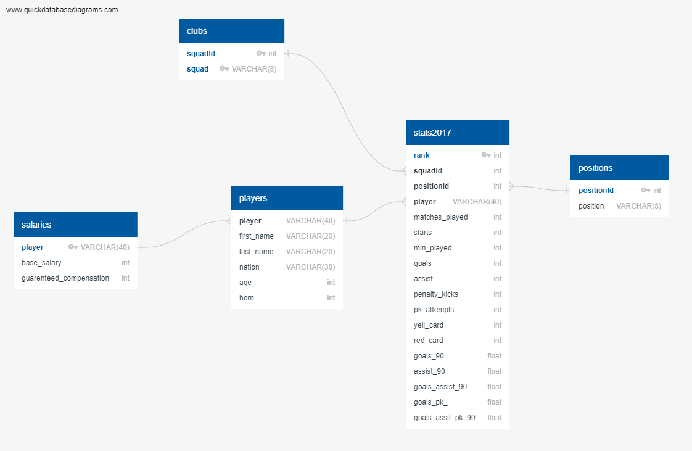

# ETL_Project

<h2 align="center">:dollar: :soccer: Major League Soccer and Salary :soccer: :dollar:</h2>

Contributers: Craig Matherson, Paul Eppers, Juliann Pezzullo, and Connor Lanier

# E: Extract 
*https://fbref.com/en/comps/22/1558/stats/2017-Major-League-Soccer-Stats#all_stats_standard

*https://www.kaggle.com/crawford/us-major-league-soccer-salaries?select=mls-salaries-2017.csv

Downloaded the CSV files from the databases found.
*    Changed the header to start at the correct place, dropping the first four rows, so would not lose any data and the data would start at the correct place.
 “Header = 5” 

# T: Transform
Following the next step of ETL to start cleaning the Fbref data to prepare it for our own database.
-    Renamed columns to make column headers clearer.
-    Cleaned up the two player columns by dropping the first player column and taking the unnecessary lettering out of the second column.
       - Chose the second column because it did not have language specific lettering such as accent marks
       - Dropped “”,”- “, out of the second column
-    Split the nation column into two additional columns. 
-    Named the two new columns Nation_2-two-digit code and Nation_3-three-digit country code
-    Changed the column types from object to integer or float where needed

Cleaned the salaries data:
-    Renamed columns as necessary 
-    Dropped unnecessary, and repeating columns (repeated from Fbref table)
-    Kept the duplicate players 
       - The repeating names came from player trades and some players in multiple clubs 
       
-    Created new tables from Fbref data allowing for smaller tables; users can choose to pull in the additional information based on their needs.

# L: Load
-    Loaded the newly transformed data and tables into postqresql

Postqresql was chosen because it allows for easier manipulation of the tables. It allows anyone wanting to determine certain functions such as, how much a player makes per min, allowing for ease of use. They can also determine how much a squad pays its players and which squad pays the most or the least. Ultimately Postgresql allowed for the most ease of use while keeping functionality.
